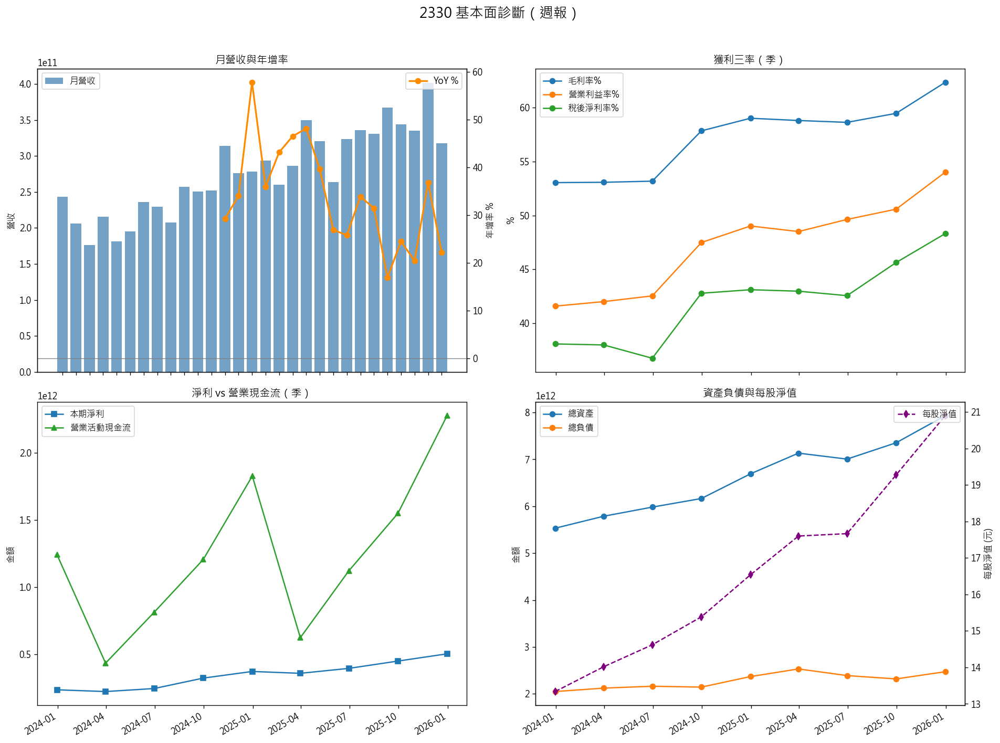

# Taiwan Stock Tracker Bot

自動追蹤台股技術面、籌碼面、總經數據，並透過 Discord Webhook 推送每日警示訊息的 Python 機器人。



---

## What It Does

每天自動抓取台股及國際市場數據，根據自訂規則產生警示，並推送到 Discord 頻道：

- **技術面** — 漲跌幅異常、爆量突破、均線多頭排列
- **籌碼面** — 外資／投信連續買超、融資減少、當沖比過熱
- **期貨** — 外資期貨未平倉淨口數變化
- **總經** — 美債殖利率（10Y / 2Y）、USD/TWD 匯率、費半與那斯達克漲跌
- **大盤** — 三大法人買賣超
- **每週基本面** — 月營收、財報數據視覺化（週六排程）

## Tech Stack

| Layer | Tools |
|-------|-------|
| Data Source | [FinMind API](https://finmindtrade.com/) |
| Language | Python 3.10+ |
| Data Processing | pandas |
| Visualization | matplotlib |
| Notification | Discord Webhook (requests) |
| Caching | SQLite (local file) |
| Scheduling | Windows Task Scheduler / cron |
| Config | python-dotenv, JSON |

## Project Structure

```
├── main.py                         # Entry point (CLI: --mode once / daily / fundamentals)
├── src/
│   ├── data_fetcher.py             # FinMind API calls + SQLite caching
│   ├── data_processor.py           # Signal computation & message formatting
│   ├── notifier.py                 # Discord Webhook sender (embeds / text / files)
│   └── visualizer.py               # Weekly fundamental charts (matplotlib)
├── config/
│   ├── .env.example                # Template — rename to .env and fill in tokens
│   └── settings.example.json       # Template — rename to settings.json
├── assets/
│   └── discord_screenshot.png      # Sample output screenshot
├── data/                           # (git-ignored) SQLite cache & run state
├── logs/                           # (git-ignored) scheduler logs
├── run_from_task_scheduler.bat     # Windows Task Scheduler helper
└── requirements.txt
```

## Getting Started

### 1. Clone

```bash
git clone https://github.com/<your-username>/stock-price-bot.git
cd stock-price-bot
```

### 2. Install dependencies

```bash
pip install -r requirements.txt
```

### 3. Configure

```bash
# Create your config files from the templates
cp config/.env.example config/.env
cp config/settings.example.json config/settings.json
```

Edit **`config/.env`** — fill in your real tokens:

| Variable | Description |
|----------|-------------|
| `FINMIND_TOKEN` | Free-tier token from [FinMind](https://finmindtrade.com/) |
| `DISCORD_WEBHOOK_URL` | Full webhook URL from your Discord server |

Edit **`config/settings.json`** — customize your watch list and alert thresholds:

| Key | Description |
|-----|-------------|
| `watch_list` | Array of stock IDs to track, e.g. `["2330", "2317"]` |
| `technical_alerts` | Price change %, volume breakout ratio, MA periods |
| `chip_alerts` | Consecutive buy days, margin reduction days |
| `futures_alerts` | Foreign futures net OI alert threshold |
| `macro_thresholds` | USD/TWD upper bound, US 10Y yield cap, index drop % |

### 4. Run

```bash
# Single execution — fetch data & push alerts immediately
python main.py --mode once

# Scheduled mode — skips if already ran today (designed for daily cron / Task Scheduler)
python main.py --mode daily

# Fetch fundamental data only (monthly revenue & financial statements)
python main.py --mode fundamentals
```

### 5. Automate (optional)

**Windows Task Scheduler:**

1. Open Task Scheduler → Create Basic Task
2. Trigger: Daily, at your preferred time (e.g. 17:00)
3. Action: Start a program → point to `run_from_task_scheduler.bat`
4. Check `logs/scheduler.log` for execution results

**Linux / macOS cron:**

```bash
# Example: run daily at 17:00 (Taiwan time)
0 17 * * * cd /path/to/stock-price-bot && python main.py --mode daily >> logs/scheduler.log 2>&1
```

## Configuration Reference

<details>
<summary>settings.json full example</summary>

```json
{
  "system_config": {
    "api_delay_seconds": 3,
    "max_retries": 3,
    "enable_macro_alerts": true,
    "enable_market_hot_stocks": false
  },
  "futures_alerts": {
    "foreign_futures_net_oi_alert": -10000
  },
  "watch_list": ["2330", "2317"],
  "technical_alerts": {
    "price_change_pct_threshold": 5.0,
    "volume_breakout_ratio": 2.0,
    "day_trade_ratio_threshold": 0.6,
    "ma_tracking": [10, 20, 60]
  },
  "chip_alerts": {
    "foreign_investor_net_buy_days": 3,
    "investment_trust_net_buy_days": 2,
    "margin_reduction_days": 3,
    "volume_threshold_shares": 1000
  },
  "macro_thresholds": {
    "usd_twd_upper_bound": 32.5,
    "us_10y_yield_upper_bound": 4.5,
    "us_index_drop_alert_pct": -2.0
  }
}
```

</details>

## Possible Improvements

- [ ] GitHub Actions workflow for cloud-based scheduling (no local machine needed)
- [ ] Taiwan stock market holiday calendar to auto-skip non-trading days
- [ ] LINE Notify or Telegram as alternative notification channels
- [ ] Web dashboard for viewing historical signals
- [ ] Unit tests for signal computation logic

## License

MIT
